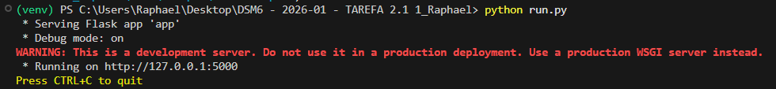
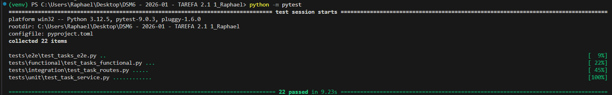
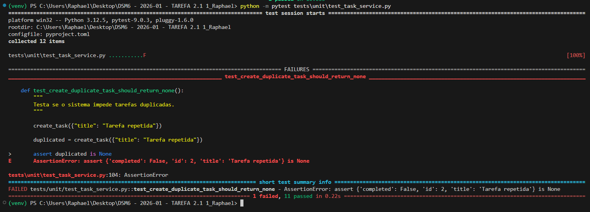
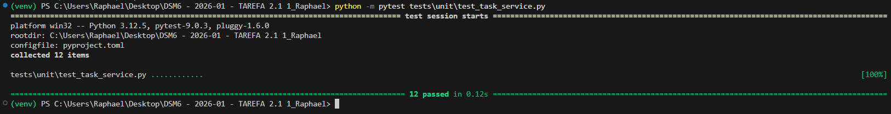
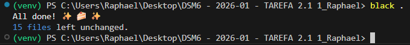
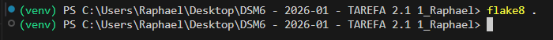
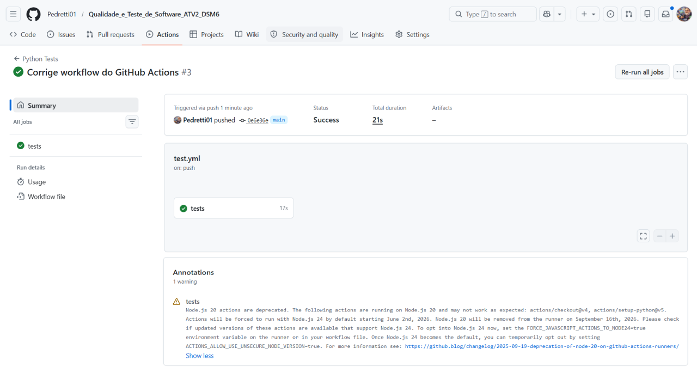

# Gerenciador de Tarefas - Qualidade e Testes de Software

Projeto desenvolvido para a disciplina **Qualidade e Testes de Software**, utilizando Flask, Pytest e Selenium para aplicação de testes automatizados em diferentes níveis da pirâmide de testes.

---

# Objetivo do Projeto

Desenvolver uma aplicação Web simples utilizando Flask para gerenciamento de tarefas, aplicando conceitos de:

- Testes Unitários
- Testes de Integração
- Testes Funcionais
- Testes E2E (End-to-End)
- TDD (Test Driven Development)
- CI/CD com GitHub Actions
- Padronização de código com Black
- Análise estática com Flake8

---

# Tecnologias Utilizadas

- Python 3.12
- Flask
- Pytest
- Selenium
- WebDriver Manager
- Black
- Flake8
- GitHub Actions

---

# Estrutura do Projeto

```text
.
├── app/
│   ├── routes/
│   │   └── task_routes.py
│   ├── services/
│   │   └── task_service.py
│   ├── templates/
│   │   └── tasks.html
│   └── __init__.py
│
├── tests/
│   ├── unit/
│   ├── integration/
│   ├── functional/
│   └── e2e/
│
├── images/
│   ├── tdd_red.png
│   ├── tdd_green.png
│   ├── app_running.png
│   ├── black_ok.png
│   ├── flake8_ok.png
│   ├── pytest_passed.png
│   └── github_actions.png
│
├── .github/
│   └── workflows/
│       └── test.yml
│
├── requirements.txt
├── pyproject.toml
├── .flake8
├── run.py
└── README.md
```

---

# Instalação do Projeto

## 1. Clonar o repositório

```bash
git clone <URL_DO_REPOSITORIO>
```

---

## 2. Criar ambiente virtual

```bash
python -m venv venv
```

---

## 3. Ativar ambiente virtual

### Windows PowerShell

```powershell
(Set-ExecutionPolicy -Scope Process -ExecutionPolicy RemoteSigned) ; (& ".\venv\Scripts\Activate.ps1")
```

---

## 4. Instalar dependências

```bash
pip install -r requirements.txt
```

---

# Executando a Aplicação

```bash
python run.py
```

A aplicação ficará disponível em:

```text
http://127.0.0.1:5000
```

---

# Aplicação em Execução



---

# Executando os Testes

## Todos os testes

```bash
python -m pytest
```

---

## Testes Unitários

```bash
python -m pytest tests/unit
```

---

## Testes de Integração

```bash
python -m pytest tests/integration
```

---

## Testes Funcionais

```bash
python -m pytest tests/functional
```

---

## Testes E2E

> Necessário deixar o Flask rodando em outro terminal.

```bash
python -m pytest tests/e2e
```

---

# Pirâmide de Testes Implementada

| Tipo de Teste | Quantidade |
|---|---|
| Unitários | 12 |
| Integração | 5 |
| Funcionais | 3 |
| E2E | 2 |

Total:

```text
22 testes automatizados
```

---

# Execução Completa dos Testes



---

# TDD - Test Driven Development

Foi implementado o ciclo:

```text
RED → GREEN → REFACTOR
```

para a funcionalidade:

```text
Impedir tarefas duplicadas
```

---

# Evidência RED

Teste falhando antes da implementação da regra de negócio.



---

# Evidência GREEN

Teste passando após implementação da regra de negócio.



---

# Black

Padronização automática do código.



---

# Flake8

Análise estática sem erros de qualidade.



---

# GitHub Actions

Pipeline CI/CD automatizada com:

- pytest
- black
- flake8



---

# Workflow GitHub Actions

```yaml
name: Python Tests

on:
  push:
  pull_request:

jobs:
  tests:
    runs-on: ubuntu-latest

    steps:
      - name: Checkout do projeto
        uses: actions/checkout@v4

      - name: Configurar Python
        uses: actions/setup-python@v5
        with:
          python-version: "3.12"

      - name: Instalar dependências
        run: |
          python -m pip install --upgrade pip
          pip install -r requirements.txt
          pip install black flake8 pytest selenium webdriver-manager

      - name: Executar Black
        run: black --check .

      - name: Executar Flake8
        run: flake8 .

      - name: Executar Pytest
        run: pytest
```

---

# Autor

**Raphael Pedretti da Silva**

Curso:
Desenvolvimento de Software Multiplataforma - FATEC Registro

Disciplina:
Qualidade e Testes de Software

Professor:
Maylon Henrique de Oliveira